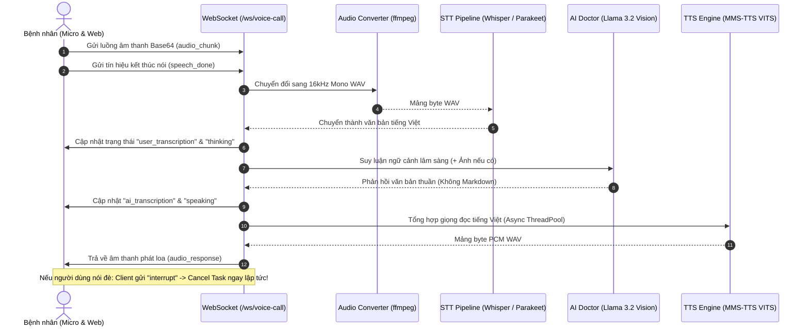
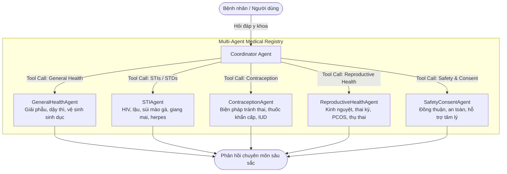

# 🩺 Reproductive Health Assistant (Hệ Thống Trợ Lý Sức Khỏe Sinh Sản Đa Phương Thức)

[](https://fastapi.tiangolo.com)
[](https://reactjs.org/)
[](https://build.nvidia.com/)
[](https://modelcontextprotocol.io/)
[](https://qdrant.tech/)
[]()

**Reproductive Health Assistant** là hệ thống trợ lý ảo y tế thế hệ mới chuyên sâu về **Sức khỏe Sinh sản, Kế hoạch hóa Gia đình, Bệnh lây truyền qua đường tình dục (STIs/STDs) và An toàn Tình dục**. 

Hệ thống được thiết kế theo chuẩn **Agentic AI & Multimodal SOTA**, kết hợp giữa **Hội thoại Thoại 2 chiều thời gian thực (Duplex Voice-to-Voice)**, **Phân tích hình ảnh bệnh lý cận cảnh (Multimodal VLM)**, **RAG 2 giai đoạn (Vector Search + Reranker)**, và **Đa tác tử chuyên khoa (Multi-Agent Coordinator)** qua giao thức chuẩn **FastMCP**.

---

## 🌟 Điểm Nhấn Công Nghệ Vượt Trội (Key Innovations)

### 1. 🎙️ Cuộc Gọi Thoại 2 Chiều Thời Gian Thực (Duplex Voice-to-Voice)
Giao tiếp giọng nói tự nhiên với bác sĩ AI qua WebSocket 2 chiều (`/ws/voice-call`) với các tính năng chuyên sâu:
- **Nhận diện ngắt lời tức thì (Real-time Interruption Handling)**: Nếu người dùng nói xen vào khi AI đang trả lời hoặc bấm ngắt lời, Server lập tức hủy bỏ tác vụ sinh giọng nói đang thực thi (`active_task.cancel()`), làm sạch bộ đệm âm thanh và chuyển trạng thái về lắng nghe trong miligiây.
- **Tiền xử lý âm thanh on-the-fly**: Bộ đệm nhận luồng Opus/WebM từ trình duyệt, chuyển đổi trực tiếp sang chuẩn âm thanh y khoa **16kHz Mono PCM WAV** thông qua `ffmpeg`.
- **Pipeline Nhận dạng Tiếng nói (STT) 3 Tầng**:
  - *Tầng 1 (Local SOTA)*: Chạy offline mô hình `faster-whisper` (`base` / fallback `tiny` int8 trên CPU) nhận dạng tiếng Việt chính xác cao, lọc tạp âm tốt.
  - *Tầng 2 (Fallback)*: Google Web Speech API tiếng Việt (`vi-VN`).
  - *Tầng 3 (Cloud Fallback)*: NVIDIA NIM ASR (`nvidia/parakeet-ctc-0.6b-vi`).
- **Tổng hợp Giọng nói Tiếng Việt (TTS) 2 Tầng**:
  - *Tầng 1 (Local Neural TTS)*: Mô hình Hugging Face VITS (`facebook/mms-tts-vie`) suy luận bất đồng bộ trong Thread Pool (`asyncio.to_thread`), xuất luồng âm thanh WAV 16-bit PCM chất lượng cao.
  - *Tầng 2 (Client Fallback)*: Web Speech Synthesis API trên trình duyệt.
- **Khám lâm sàng qua ảnh ngay trong cuộc gọi (Visual Voice Consultation)**: Người dùng có thể vừa nói chuyện vừa tải ảnh tổn thương nhạy cảm; bác sĩ AI sẽ quan sát ảnh và trả lời trực tiếp bằng giọng nói!
- **Voice-Optimized Prompting**: Tự động loại bỏ hoàn toàn các ký tự Markdown (`**`, `#`, danh sách bullet) để giọng đọc phát âm tự nhiên như bác sĩ trò chuyện ngoài đời thực.



---

### 2. 🔬 Phân Tích Hình Ảnh Bệnh Lý Cận Cảnh (Multimodal VLM)
Hỗ trợ khám thị giác thông qua mô hình **Meta Llama 3.2 11B Vision Instruct** (qua NVIDIA NIM):
- **Phản xạ 2 chế độ thông minh (Dual-Mode Engine)**:
  1. *Chế độ Chẩn đoán (Diagnostic Mode)*: Tự động xuất **Báo cáo Phân tích Lâm sàng Sơ bộ**:
     - 🏥 **Bệnh lý nghi ngờ (Suspected Condition)**: Tên tiếng Việt và danh pháp y khoa quốc tế (VD: Sùi mào gà - *Condyloma acuminatum*, Mụn rộp sinh dục - *Herpes simplex*).
     - 📍 **Vị trí giải phẫu**: Vùng da/niêm mạc quan sát được.
     - 🔍 **Hình thái tổn thương**: Kích thước, màu sắc, sẩn gồ ghề dạng súp lơ, vết trợt loét, mụn nước dạng chùm...
     - 🧬 **Cơ chế bệnh sinh & Tác nhân**: Virus HPV (type 6, 11...), HSV, vi khuẩn...
     - 💡 **Khuyến nghị y tế**: Chuyên khoa cần khám, xét nghiệm khuyên làm (PCR, huyết thanh), lưu ý an toàn (kiêng quan hệ, không tự nặn/bôi thuốc dân gian).
  2. *Chế độ Thấu cảm & Trấn an (Empathy Mode)*: Khi người dùng bày tỏ lo lắng hoặc hoảng sợ, AI chuyển sang giọng điệu bác sĩ tâm lý ân cần, giải tỏa căng thẳng trước khi hướng dẫn y tế.

---

### 3. 🧠 Điều Phối Đa Tác Tử Chuyên Khoa (Multi-Agent Coordinator)
Hệ thống không dùng một chatbot cồng kềnh duy nhất mà chia thành **1 Coordinator Agent** và **5 Agent Chuyên khoa**:



- **Function Calling Tự Động**: `CoordinatorAgent` áp dụng LLM Tool-Calling để chọn đúng 1 chuyên gia tốt nhất dựa theo ngữ cảnh và bệnh sử của bệnh nhân.
- **FastMCP Protocol**: Toàn bộ các Agent được xuất thành MCP Tools tiêu chuẩn tại `backend/app/mcp/server.py`, sẵn sàng tích hợp với **Claude Desktop**, **Cursor**, **Antigravity IDE** hoặc bất kỳ ứng dụng nào hỗ trợ chuẩn Model Context Protocol.

---

### 4. 📚 RAG 2 Giai Đoạn & Đánh Giá Chuẩn RAGAS (Two-Stage RAG Pipeline)
- **Cơ sở dữ liệu tri thức**: Hơn 425 bài viết chuyên sâu từ MedlinePlus, Bedsider, Love is Respect, KidsHealth được vector hóa bằng mô hình `Qwen3-Embedding-0.6B` (FP16).
- **Vector Database**: Qdrant Local Engine (`qdrant_data/`), tối ưu Cosine Distance.
- **Giai đoạn 1 (Dense Retrieval)**: Lấy Top 30 bài viết tương đồng cao nhất.
- **Giai đoạn 2 (Cross-Encoder Reranker)**: Sử dụng mô hình `nv-rerank-qa-mistral-4b:1` của NVIDIA để tính toán lại tương quan câu hỏi - văn bản, trích xuất Top 5 đoạn văn tinh hoa nhất.
- **Bộ đo lường RAGAS toàn diện**: Kiểm thử trên bộ dataset y khoa **850 câu hỏi chuẩn** (`data/datasets/rag_test_dataset_850.json`), đo lường Hit Rate @1, @3, @5, @10, MRR, NDCG cùng các chỉ số RAGAS: *Faithfulness*, *Answer Relevance*, *Context Recall*, và *Context Precision* do LLM-as-a-Judge (FPT Gemma 4) chấm điểm độc lập.

---

## 📁 Cấu Trúc Dự Án Chuẩn Senior Product

```
reproductive-health-assistant/
├── backend/app/                      # Toàn bộ mã nguồn Backend chuyên biệt (Modular Monolith)
│   ├── core/                         # Cấu hình hệ thống & Prompts y khoa
│   │   ├── config.py                 # Quản lý Settings & biến môi trường an toàn
│   │   └── prompts.py                # Toàn bộ System Prompts y khoa (5 Agents + Judge)
│   ├── schemas/                      # Pydantic Schemas & DTOs
│   │   └── chat.py                   # Data contracts (Message, ChatRequest, ChatResponse, v.v.)
│   ├── services/                     # Business logic & Dịch vụ AI bên ngoài
│   │   ├── nvidia_service.py         # Client NVIDIA NIM (VLM, LLM, STT, TTS, ffmpeg)
│   │   └── voice_service.py          # Quản lý phiên đàm thoại thoại 1-1, VAD & ngắt lời
│   ├── agents/                       # Multi-Agent Subsystem
│   │   ├── base.py                   # Lớp nền tảng BaseAgent
│   │   ├── coordinator.py            # CoordinatorAgent & AGENT_REGISTRY
│   │   ├── general.py                # Agent Sức khỏe sinh sản đại cương & Giải phẫu
│   │   ├── sti.py                    # Agent Bệnh lây qua đường tình dục (STIs)
│   │   ├── contraception.py          # Agent Biện pháp tránh thai & Kế hoạch hóa
│   │   ├── reproductive.py           # Agent Sức khỏe sinh sản & Sinh lý phụ khoa/nam khoa
│   │   └── safety.py                 # Agent An toàn tình dục, Đồng thuận & Tâm lý
│   ├── api/                          # Endpoints REST & WebSockets
│   │   ├── router.py                 # Main API Router
│   │   └── endpoints/
│   │       ├── chat.py               # REST POST /chat & WebSocket /ws/chat (Text & VLM streaming)
│   │       └── voice.py              # WebSocket /ws/voice-call (Audio streaming đàm thoại 1-1)
│   ├── mcp/                          # Giao thức FastMCP Server
│   │   └── server.py                 # FastMCP server & MCP tools definition
│   └── main.py                       # FastAPI App Factory & Mount static React
│
├── health-chat-companion/            # Giao diện Frontend React + TypeScript + Tailwind
│   ├── src/                          # Components (VoiceCallModal, ChatWindow, InputBox, v.v.)
│   ├── dist/                         # Bản build tĩnh phục vụ trực tiếp qua FastAPI
│   └── package.json
│
├── data/                             # Dữ liệu có cấu trúc & Vector tri thức
│   ├── knowledge_base/               # Dữ liệu thô bài viết y khoa & index
│   ├── embeddings/                   # Vector embeddings của cơ sở dữ liệu tri thức (9.8MB)
│   └── datasets/                     # Bộ dữ liệu kiểm thử y khoa (850 câu hỏi chuẩn)
├── docs/                             # Báo cáo kỹ thuật & Đặc tả danh mục hình ảnh lâm sàng VLM
├── scripts/                          # Script cào data & Bộ công cụ đo lường benchmark RAGAS
│   ├── crawl.py                      # Kịch bản thu thập tri thức y khoa đa nguồn
│   ├── setup_qdrant.py               # Nạp vector embeddings vào Qdrant Vector DB
│   └── evaluation/                   # Bộ công cụ Benchmark & Đo lường RAGAS
│
├── main.py                           # [RUNNER DUY NHẤT Ở ROOT] Khởi chạy máy chủ FastAPI Uvicorn
├── Dockerfile                        # Multi-stage Dockerfile tối ưu (bake sẵn weights model STT/TTS)
├── docker-compose.yml                # Docker compose orchestration
├── requirements.txt                  # Python dependencies
├── .env.example                      # Template cấu hình biến môi trường mẫu
├── .gitignore                        # Gitignore chuyên nghiệp
├── .dockerignore                     # Dockerignore tối ưu dung lượng context
└── README.md                         # Tài liệu dự án
```

---

## 🚀 Hướng Dẫn Cài Đặt & Khởi Chạy

### 1. Yêu Cầu Môi Trường
- **Python**: 3.10 trở lên
- **Node.js**: 18 trở lên (để phát triển Frontend)
- **ffmpeg**: Cần thiết cho việc xử lý và chuyển mã audio sang 16kHz WAV

### 2. Cài Đặt Dependencies

```bash
# Cài đặt thư viện Python
pip install -r requirements.txt

# Cài đặt và build Frontend React
cd health-chat-companion
npm install
npm run build
cd ..
```

### 3. Cấu Hình Biến Môi Trường

Tạo file `.env` từ file mẫu:
```bash
cp .env.example .env
```

Điền các thông tin API keys cần thiết:
```env
# ── Core LLM (FPT Cloud / OpenAI-Compatible) ──
API_URL=https://mkp-api.fptcloud.com/v1
API_KEY=your_api_key_here
MODEL_NAME=gemma-4-31B-it

# ── NVIDIA NIM APIs (VLM, LLM, STT, TTS) ──
NVIDIA_API_KEY=nvapi-your_primary_nvidia_api_key
NVIDIA_SPEECH_API_URL=https://integrate.api.nvidia.com/v1

# ── Máy Chủ ──
PORT=8010
```

### 4. Khởi Chạy Hệ Thống

#### Cách 1: Khởi chạy Trực tiếp Máy chủ FastAPI
```bash
python main.py
```
- Ứng dụng Web Chat & Voice Call: [http://localhost:8010](http://localhost:8010)
- Swagger API Docs tương tác: [http://localhost:8010/docs](http://localhost:8010/docs)

#### Cách 2: Chạy FastMCP Server (Kết nối Claude Desktop, Cursor)
```bash
python -m backend.app.mcp.server
```

#### Cách 3: Khởi chạy bằng Docker
Hệ thống sử dụng Dockerfile multi-stage build, tự động pre-download sẵn trọng số mô hình TTS (`facebook/mms-tts-vie`) và Whisper (`base`) ngay trong giai đoạn build image, giúp container khởi động tức thì:
```bash
docker compose up --build -d
```

---

## 📡 Danh Mục API & Giao Thức Kết Nối

| Giao thức | Endpoint | Chức năng chi tiết |
| :--- | :--- | :--- |
| **HTTP POST** | `/chat` | Nhận tin nhắn văn bản, tự động định tuyến qua Coordinator và trả về JSON câu trả lời. |
| **WebSocket** | `/ws/chat` | Streaming phản hồi văn bản theo thời gian thực (token-by-token) hoặc truyền Base64 hình ảnh để VLM phân tích lâm sàng. |
| **WebSocket** | `/ws/voice-call` | Đàm thoại trực tiếp 2 chiều: Audio chunk streaming, VAD, STT tiếng Việt, VLM/LLM reasoning, TTS âm thanh, và xử lý ngắt lời (`interrupt`). |
| **MCP Tool** | `coordinator` | Tool FastMCP tự động phân loại và định tuyến câu hỏi tới Agent chuyên môn. |
| **MCP Tool** | `general_health_agent` | Tool FastMCP trả lời sức khỏe chung, giải phẫu, dậy thì. |
| **MCP Tool** | `sti_agent` | Tool FastMCP trả lời về bệnh lây truyền qua đường tình dục. |
| **MCP Tool** | `contraception_agent` | Tool FastMCP trả lời về các biện pháp tránh thai và kế hoạch hóa. |
| **MCP Tool** | `reproductive_health_agent` | Tool FastMCP trả lời về chu kỳ kinh nguyệt, thai kỳ, phụ khoa. |
| **MCP Tool** | `safety_consent_agent` | Tool FastMCP tư vấn sự đồng thuận, an toàn và hỗ trợ tâm lý. |

---

## 📊 Bộ Đánh Giá & Benchmark Chất Lượng (RAGAS)

Tất cả các công cụ đo lường được đặt trong thư mục `scripts/`:
- **Nạp tri thức vào Qdrant**: `python scripts/setup_qdrant.py`
- **Đo lường Retrieval Hit Rate & MRR**: `python scripts/evaluation/evaluate_rag.py`
- **Chạy Benchmark các mô hình sinh (Generators)**: `python scripts/evaluation/benchmark_nvidia_models.py`
- **Chấm điểm RAGAS với LLM-as-a-Judge**: `python scripts/evaluation/evaluate_ragas.py`
- **Xuất bảng tổng hợp xếp hạng (Leaderboard)**: `python scripts/evaluation/eval_full.py`

---

## 🛡️ Cam Kết Đạo Đức & Bảo Mật Dữ Liệu Y Khoa
- **Ẩn danh tuyệt đối**: Hệ thống không lưu trữ hay yêu cầu bất kỳ thông tin nhận dạng cá nhân (PII) nào của người dùng.
- **Tư vấn phi phán xét**: Tất cả các Agent được trang bị bộ quy chuẩn System Prompt thấu cảm, văn phong y khoa ấm áp, tôn trọng và đồng hành cùng người bệnh.
- **Ranh giới chuyên môn**: Hệ thống đóng vai trò cung cấp kiến thức giáo dục y khoa và định hướng thăm khám, luôn khuyến nghị người dùng đến các cơ sở y tế uy tín để thực hiện xét nghiệm lâm sàng chính thức khi có triệu chứng bất thường.
